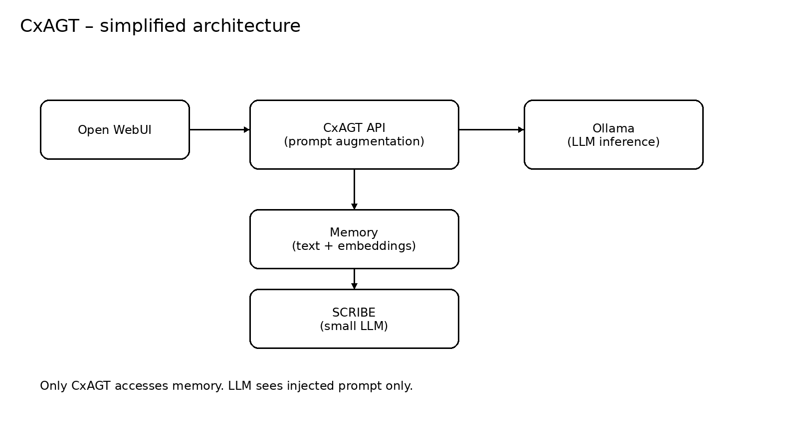

# Simple Context Augmentor (CxAGT)
CxAGT - Experimental LLM memory wrapper for context, memory logging and embedding-based retrieval around local models (Ollama). Status: experimental / learning project.

What CxAGT does:
CxAGT is a lightweight proxy or Ollama wrapper that sits in front of a local Ollama instance and augments chat requests with context derived from prior interactions.

CxAGT is also Open WebUi compatible, which means you can add CxAGT as a Ollama API connection using the proxy adress http://localhost:11400.

Use case:
When you need a lightweight / transparent memory and context augmenter for local LLMs.
